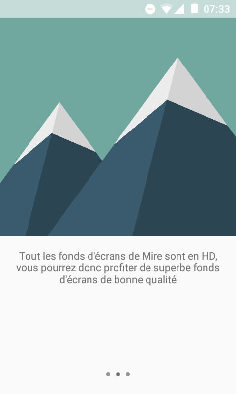
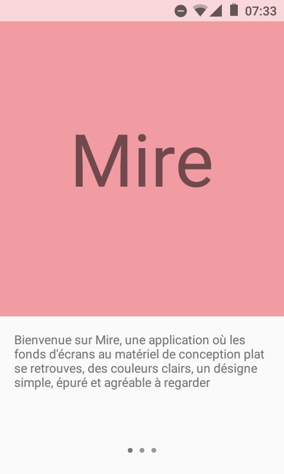
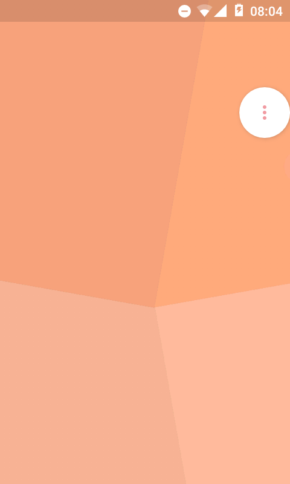

# Mire

 

### FR-US
* Ceci est le projet de Mire
* This the project of Mire

### Description
* Mire est un simple projet de gestionnaire de fonds d'écrans, ce projet met en œuvre une **Animation de Transition** entre **Fragment** de **Daniel Zeller**
* Mire is a simple project of manager of wallpapers, this project implements a **Animation of Transition** between **Fragment** of **Daniel Zeller**

### Captures d'écrans

### Clone Git Repository
* S'il vous plaît rafraichissez le projet
* Please Refresh Build

### Supplémentaires
Ce projet utilise les librairies suivantes:
* [Helpers](https://github.com/msay2) par **Meclot Yoann** (MSay2)
* [DepthLib](https://github.com/danielzeller/Depth-LIB-Android-) par **Daniel Zeller**
* [PreLollipopTransition](https://github.com/takahirom/PreLollipopTransition) par **Takahirom**
* [Glide](https://github.com/bumptech/glide) par **Bumptech**
* [UniversalImageLoader](https://github.com/nostra13/Android-Universal-Image-Loader) par **Sergey Tarasevich**
* [HTML TextView](https://github.com/SufficientlySecure/html-textview) par **Sufficiently Secure**

# Mire
par **Meclot Yoann**
